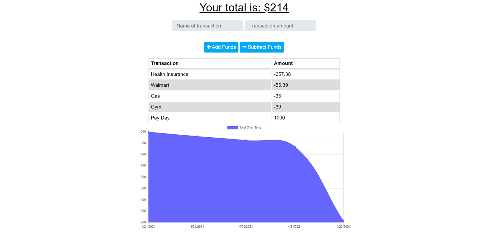

# Budget Tracker

## Description
The budget tracker is a fast and easy way for a user to track their withdrawals and deposits with or without a data/internet connection so that they have an accurate account balance.

## Usage
Clone the repo to your computer and in your favorite [CLI](https://www.w3schools.com/whatis/whatis_cli.asp), navigate to the root folder and type `npm install` to install all the dependencies for this project. You will need a Mongo database and database connection set up to save the budget data. Type `npm start` to start the server at localhost:3000. 

## Technologies
* [Express](https://www.npmjs.com/package/express)
* [MongoDB Atlas](https://www.mongodb.com/)
* [Mongoose](https://www.npmjs.com/package/mongoose)
* [Dotenv](https://www.npmjs.com/package/dotenv)
* [Lite-server](https://preview.npmjs.com/package/lite-server)
* [Compression](https://www.npmjs.com/package/compression)
* [Morgan](https://www.npmjs.com/package/morgan)
* [Chart.js](https://www.chartjs.org/)
* [Heroku](https://www.heroku.com/)

## Screenshot

## URL
[Git](https://github.com/crrmarchese/budget-tracker) 
[Heroku](https://budget-tracker-app-cm.herokuapp.com)